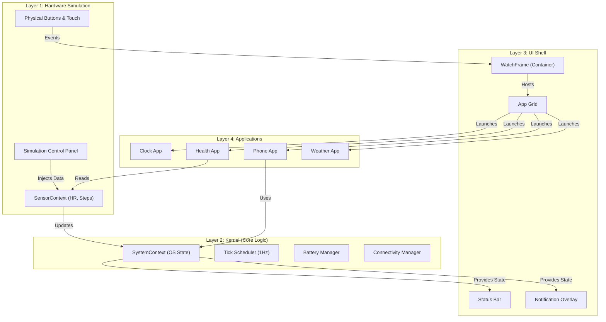
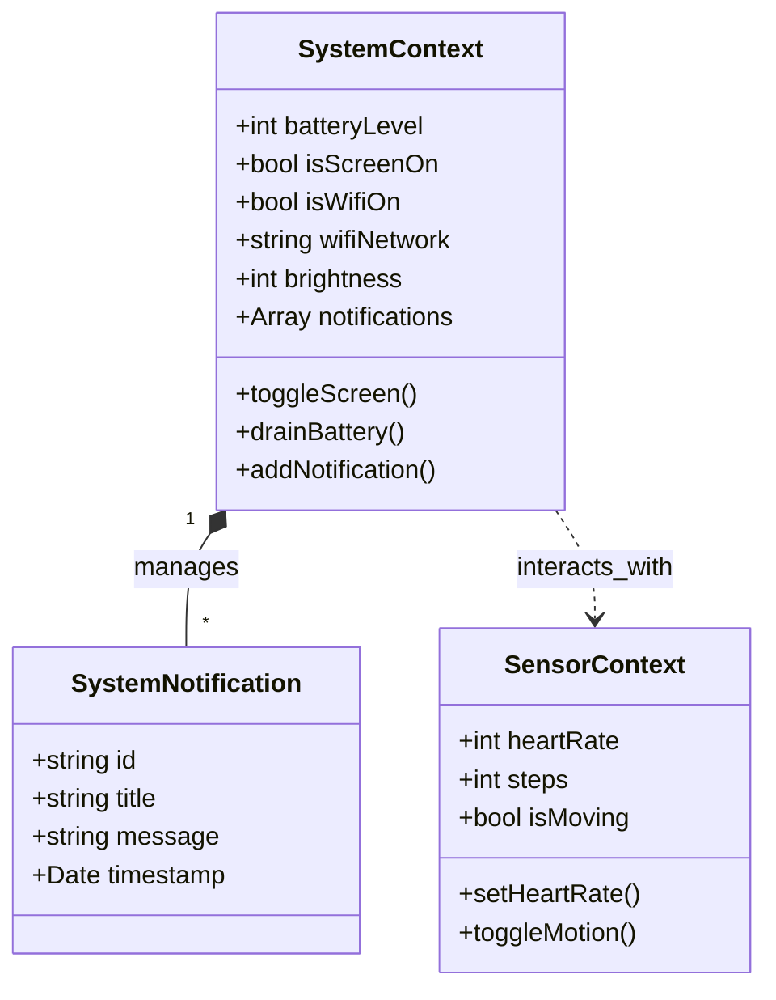
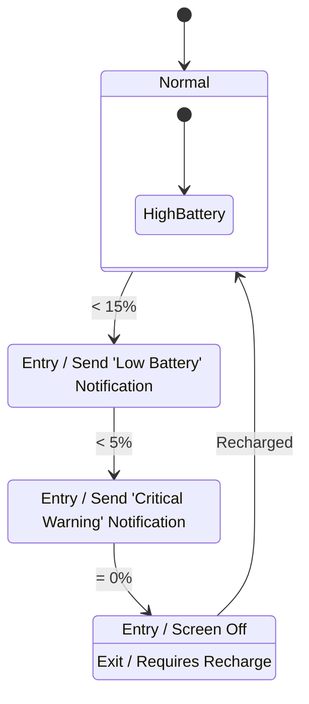
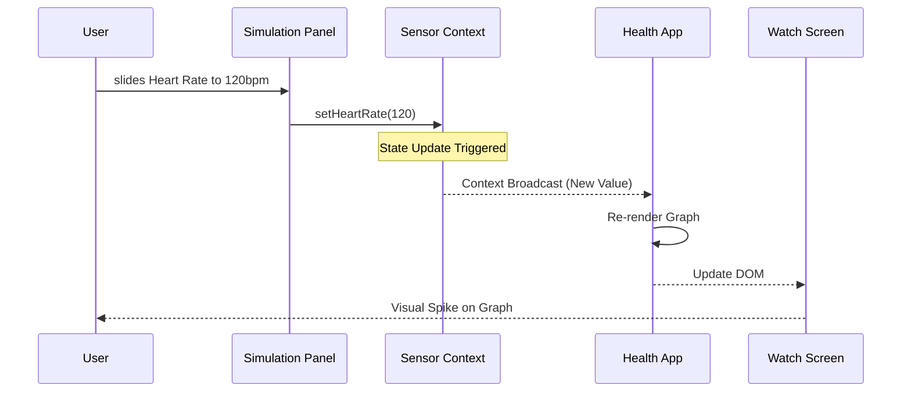

# System Diagrams (Group 45)

This document contains visual diagrams reflecting the architecture and design of our Wearable OS Simulation. These can be used in the Technical Report or Presentation.

## 1. System Architecture Diagram
This high-level overview shows the layered architecture of the simulation, from the simulated hardware up to the user-facing applications.

## 2. Kernel Class Diagram
A detailed view of the primary state containers (Contexts) acting as the OS Kernel.

## 3. Battery Management State Machine
Visualizing the transitions between different battery states and the actions triggered (Alerts, Shutdown).

## 4. Sensor Data Flow Sequence
Tracing the path of a sensor event (simulated heart rate change) through the system.

